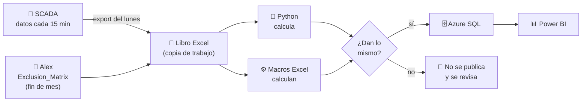

# ETL_Arena — Disponibilidad de PCS y baterías de Arena BESS

## ¿Qué es esto?

**Arena BESS** es una planta que guarda energía en baterías. Por contrato, Trina Solar debe demostrar cada mes qué
porcentaje del tiempo estuvieron **disponibles** sus baterías: ese número es la **disponibilidad** (el KPI).

Hasta ahora, ese cálculo se hacía con un **libro Excel con macros**. Funciona, pero es manual, difícil de auditar y
depende de una sola planilla. Este proyecto hace **el mismo cálculo con Python** y guarda cada resultado en una
**base de datos en la nube (Azure SQL)**, de donde lo lee **Power BI**.

La regla principal: **el nuevo sistema debe dar exactamente los mismos números que el Excel** antes de reemplazarlo.
Hoy ya lo hace, dígito por dígito, en julio, agosto y septiembre de 2026.

> ¿Palabras raras? Todas están en el [glosario](./docs/glosario.md).

## ¿Por dónde empiezo?

| Quiero… | Leo… |
|---|---|
| Entender las palabras (PCS, rack, SCADA, exclusión…) | [Glosario](./docs/glosario.md) |
| Instalar el proyecto en un computador | [Guía de instalación](./docs/instalacion.md) |
| Hacer la corrida de cada lunes o el cierre de mes | [Guía del lunes](./docs/runbook-lunes.md) |
| Entender qué se guarda en la base de datos | [Modelo de datos](./docs/modelo-datos.md) (con diagramas) |
| Conectar Power BI | [Handoff Power BI](./docs/pbi-handoff.md) |
| Ver el avance del periodo de prueba en paralelo | [Registro del shadow mode](./docs/shadow-log.md) |
| Saber si ya se puede dejar el Excel | [Go / no-go](./docs/go-no-go.md) |

## ¿Cómo funciona?



1. Cada lunes se **exporta** de SCADA lo que informaron los equipos en la semana.
2. Esos datos se agregan a una **copia** del libro Excel (los originales nunca se tocan).
3. **Python calcula** la disponibilidad y, en paralelo, las **macros del Excel** calculan lo mismo.
4. Si los dos resultados son **idénticos**, se guarda en la base de datos y se avisa a Misael para Power BI.
5. A fin de mes, Alex entrega la **matriz de exclusiones** (fallas que no son culpa de la planta) y se hace el
   **cierre mensual**.

Todo eso lo hace **un solo comando** (`scripts/run_lunes.py`). Paso a paso en la [guía del lunes](./docs/runbook-lunes.md).

## La planta en números

| Dato | Valor |
|---|---|
| Inicio de operación | 08-04-2026 |
| PCS (equipos convertidores) | 61 |
| Baterías (módulos BEC) por PCS | 4 → 244 en total |
| Racks por batería | 12 → **2.928 racks** en total |
| Frecuencia de los datos | cada 15 minutos |

**Cómo se calcula la disponibilidad:**

```text
Disponibilidad = 1 − (racks indisponibles acumulados) / (2.928 racks × cantidad de bloques de 15 min)
```

- Cada 15 minutos, SCADA dice cuántas de las 4 baterías de cada PCS funcionan (`NUMBER_OF_MODULES`).
- Si un PCS tiene 3 baterías, en ese bloque faltan 12 racks (1 batería × 12 racks). Eso se suma.
- Ejemplo real: septiembre 1–21 de 2026 → 1.975 bloques, 104.134,292 racks-bloque indisponibles →
  **disponibilidad 98,20 %**.
- Si el dato viene vacío, se cuenta como disponible (igual que el Excel), pero queda marcado para revisarlo.

## Estado del proyecto (25-09-2026)

| Parte | Estado |
|---|---|
| Entender el Excel a fondo (macros y fórmulas) | ✅ Listo |
| Cálculo en Python idéntico al Excel | ✅ Listo (julio, agosto y septiembre, dígito por dígito) |
| Base de datos en Azure y comparación automática con Excel | ✅ Listo |
| Corrida del lunes y cierre de mes en un comando | ✅ Listo |
| Carga de la matriz de exclusiones de Alex | 🟡 Lista; falta probarla con una entrega real |
| Lectura automática del export de SCADA | ⏳ Esperando una muestra real del export (hoy las filas se pegan a mano) |
| Libro maestro v1.1 (Excel que aplica la matriz) | ⏳ Tarea de Francisco |
| Periodo de prueba en paralelo (4 lunes + 1 cierre) | ⏳ Por empezar |
| Decisión de dejar el Excel | ⏳ Después del periodo de prueba ([go/no-go](./docs/go-no-go.md)) |

## Las dos bases de datos: PROD y TEST/QA

| Ambiente | Base de datos (Azure) | Para qué | Cómo se elige |
|---|---|---|---|
| **PROD** (producción) | `trina_etl` | Resultados **oficiales**: los que ve Power BI | Por defecto (o `--entorno produccion` / `prod`) |
| **TEST/QA** (pruebas) | `trina_etl_prueba` | **Practicar y validar** sin tocar lo oficial | `--entorno prueba` (o `qa` / `test`) |

Las dos están en el servidor `trina-etl.database.windows.net`, tienen **las mismas tablas y vistas**, y se entra
con la cuenta @trinasolar.com. Las direcciones **ya vienen escritas en el código** (`src/etl_arena/ambientes.py`):
un computador nuevo apunta a las bases correctas **sin configurar nada**.

> ⚠️ Las pruebas automáticas de los programadores (`pytest -m sql`) usan **una tercera base aparte** (`ETL_ARENA_TEST_DB_URL`, con "test" en el nombre) porque la **borran** cada vez. Nunca se configura ahí `trina_etl` ni `trina_etl_prueba`: el código lo impide.

## Reglas que nunca se rompen

1. **No se cambia el cálculo** mientras el Excel sea el oficial: se copia exactamente, incluso sus rarezas.
2. **Lo que decide si hay falla es `NUMBER_OF_MODULES`** (cuántas baterías funcionan), no el código de falla.
3. **Nada se borra de la base de datos.** Cada cálculo queda guardado con su propio código (`IdCorrida`).
4. **Los archivos originales no se tocan:** el export se guarda con su "huella" (sha256) y el Excel se trabaja en copias.
5. **En el server SCADA solo se exporta.** Todo el proceso corre en el computador local.
6. **Las exclusiones salen solo de la `Exclusion_Matrix`** de Alex (`PlantActivity` no, hasta que Alex lo confirme).
7. **No hay contraseñas guardadas:** se entra a la base con la cuenta @trinasolar.com.

## Carpetas del proyecto

```text
ETL_Arena/
├── data/                  ← los libros Excel oficiales
│   ├── inbox/             ← aquí se deja el export de SCADA cada lunes
│   ├── processed/         ← los exports ya usados (no se tocan nunca)
│   └── work/              ← copias de trabajo de cada semana (una carpeta por corte)
├── docs/                  ← toda la documentación para personas
├── scripts/               ← los programas que se ejecutan (run_lunes.py, verificar_entorno.py…)
├── src/etl_arena/         ← el código del cálculo
├── sql/                   ← la estructura de la base de datos
├── tests/                 ← pruebas automáticas
├── .env.example           ← modelo del archivo de configuración
├── AGENTS.md, CLAUDE.md   ← documentación técnica para agentes de IA
└── README.md              ← este archivo
```

---

## Para desarrolladores

### Instalación rápida

Guía completa y para no programadores: [docs/instalacion.md](./docs/instalacion.md).

```powershell
python -m venv .venv                                   # Python >= 3.13
.venv\Scripts\python -m pip install -e ".[dev]"
Copy-Item .env.example .env                             # y completar (ver instalacion.md, paso 5)
.venv\Scripts\python scripts\verificar_entorno.py       # revisa todo el entorno
```

### Pruebas

```powershell
.venv\Scripts\python -m pytest -q                                       # ~372 tests (markers: golden, sql, excel)
$env:ETL_ARENA_EXCEL = "1"; .venv\Scripts\python -m pytest tests\com -q  # macros reales vía COM (~2 min)
.venv\Scripts\python -m ruff check src tests scripts
```

- Los tests de integración SQL (`-m sql`) usan `ETL_ARENA_TEST_DB_URL` (instancia local; crean y borran su propia base).
- Los goldens (`tests/golden/data/`) son resultados del Excel usados como respuestas correctas; se regeneran con
  `tests/golden/extract_golden.py`.

### Scripts

| Script | Para qué |
|---|---|
| `scripts/run_lunes.py` | Orquestador: corrida semanal, `cierre-mensual`, `load-exclusion-matrix`, `--entorno prueba` |
| `scripts/ejecutar_etl.py` | Solo el cálculo Python sobre un libro ya preparado (`--sin-bd`, `--referencia libro`, `--oficial`) |
| `scripts/verificar_entorno.py` | Revisa Python, paquetes, driver ODBC, `.env`, red, base de datos y Excel |
| `scripts/shadow_log.py` | Registra cada corrida del periodo de prueba y evalúa el criterio de salida |
| `scripts/crear_base.py` | Crea/actualiza las tablas (idempotente; en Azure no crea la base) |
| `scripts/generar_seed_tipo_detencion.py` | Regenera el catálogo de códigos de falla desde `PCS-Fault` |

### Base de datos

- **Azure SQL Database serverless** `trina-etl.database.windows.net` (Brazil South), entrada con Microsoft Entra ID
  (por defecto). Ambientes fijos en `src/etl_arena/ambientes.py`: **PROD** `trina_etl` (por defecto) y **TEST/QA**
  `trina_etl_prueba` (`--entorno prueba|qa|test` o `ETL_ARENA_ENTORNO`). `ETL_ARENA_DB_URL` /
  `ETL_ARENA_DB_URL_PRUEBA` solo reemplazan esas direcciones (p. ej. una instancia local).
- Tests de integración (`-m sql`): base propia en `ETL_ARENA_TEST_DB_URL` con "test" en el nombre; `reiniciar_esquema`
  se niega a tocar `trina_etl` y `trina_etl_prueba`.
- Requiere **ODBC Driver 18 for SQL Server**.
- Modelo conceptual, tablas y vistas: [docs/modelo-datos.md](./docs/modelo-datos.md). DDL en `sql/`.
- Todas las fechas en `DATETIME`; SQL **append-only** por `IdCorrida`.

### Reglas técnicas

1. No modificar el algoritmo durante la fase de paridad; reproducir incluso los defectos del VBA (con flags).
2. No hardcodear `61`, `4`, `12`, `15`: vienen de `ConfiguracionCalculo`.
3. Conservar `SerialFechaExcelOrigen` + `MarcaTiempoLocalOrigen`; no convertir a UTC.
4. Marcar `ModulosDisponiblesNulo` y `DescripcionFallaFallback` para auditoría.
5. Toda corrida registra `VersionAlgoritmo = "availability-v1.1-exclusion-matrix"`.
6. El pipeline nunca edita VBA ni el libro base.

### Inspeccionar el Excel sin abrirlo

```bash
python -m oletools.olevba "data/AvailabilityCalculation_PCS&Batteries_20260907_septiembre 2026.xlsm"   # código VBA
unzip -p "data/AvailabilityCalculation_PCS&Batteries_20260907_septiembre 2026.xlsm" xl/workbook.xml     # hojas
```

Las hojas `DateFormat_Correction` y `PlantActivity` pesan ~5 MB de XML: usar `unzip -p … | grep`.

### Documentación técnica

| Archivo | Contenido |
|---|---|
| [`AGENTS.md`](./AGENTS.md) | Plan de reingeniería completo: lógica exacta de las macros, fórmulas, diseño SQL, ETL, paridad |
| [`CLAUDE.md`](./CLAUDE.md) | Contexto técnico resumido para agentes de IA |
| `.kiro/specs/etl-arena-availability/` | Especificación ejecutable (rev. 2): `audit.md` (hallazgos F-xx), `requirements.md`, `design.md`, `tasks.md` |
| [`docs/data-contract-libro.md`](./docs/data-contract-libro.md) | Contrato de datos del libro Excel (hojas, columnas, tipos) |
| [`docs/adr/`](./docs/adr/) | Decisiones de arquitectura (ADR) y decisiones de negocio abiertas (D-xx) |
