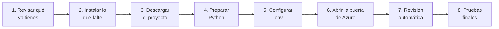

# Instalación paso a paso

Para: quien va a instalar el proyecto en un computador nuevo (por ejemplo, la laptop de la empresa), aunque nunca
haya programado. Si una palabra no se entiende, está en el [glosario](./glosario.md).

**Tiempo estimado:** 30 a 60 minutos (más si hay que pedir algo a TI).
**Sistema:** Windows 10 u 11. Todos los comandos se escriben en **PowerShell** (menú Inicio → escribir
"PowerShell" → Enter). Se copian tal cual, se pegan con clic derecho y se ejecutan con Enter.

---

## Resumen: qué vamos a hacer



## Qué necesita el computador

| Programa | Para qué sirve | ¿Necesita administrador? |
|---|---|---|
| **Git** | Descargar el proyecto desde GitHub y recibir sus actualizaciones | Normalmente sí. Si no te deja, pedir a TI |
| **Python 3.13** (o más nuevo) | Es el "motor" que hace todos los cálculos | **No** (se instala "solo para mí") |
| **Excel de escritorio** (Office) | Correr las macros del libro para comparar resultados | No (ya viene con Office) |
| **ODBC Driver 18 for SQL Server** | Permite que Python se conecte a la base de datos | **Sí**: casi siempre hay que pedírselo a TI |
| **Internet hacia Azure** (puerto 1433) | Guardar los resultados en la base de datos | La red de la oficina debe permitirlo (TI) |
| **Cuenta @trinasolar.com** | Iniciar sesión en la base de datos (sin contraseñas guardadas) | — |

---

## Paso 1 — Revisar qué ya tienes

Copia y pega estos comandos en PowerShell, uno por uno:

```powershell
git --version
python --version
Get-OdbcDriver -Name "ODBC Driver 18 for SQL Server"
Test-NetConnection trina-etl.database.windows.net -Port 1433
```

| Si ves… | Significa |
|---|---|
| `git version 2.x` | ✅ Git instalado |
| `Python 3.13.x` o mayor | ✅ Python instalado |
| Un bloque que dice `ODBC Driver 18 for SQL Server` | ✅ Driver instalado |
| `TcpTestSucceeded : True` | ✅ La red deja llegar a Azure |
| Un error, `no se reconoce`, nada, o `False` | ❌ Hay que instalarlo o pedirlo (paso 2) |

> Si `python --version` abre la **Microsoft Store**, es un atajo falso de Windows: desactívalo en
> *Configuración → Aplicaciones → Configuración avanzada de aplicaciones → Alias de ejecución de aplicaciones →*
> apagar "python.exe" y "python3.exe". Después instala Python como dice el paso 2.

## Paso 2 — Instalar lo que falte

**Git**
1. Entra a <https://git-scm.com/download/win> y descarga el instalador de 64 bits.
2. Ábrelo y presiona *Next* en todo (las opciones por defecto están bien).
3. Si pide permisos de administrador y no los tienes, pídele a TI que lo instale.

**Python 3.13**
1. Entra a <https://www.python.org/downloads/windows/> y descarga el *Windows installer (64-bit)* de la versión 3.13.
2. Al abrirlo, en la **primera pantalla**:
   - ✅ marca **"Add python.exe to PATH"** (muy importante);
   - ⬜ desmarca **"Use admin privileges when installing py.exe"** (así no pide administrador).
3. Presiona **Install Now** y espera.
4. **Cierra PowerShell y ábrelo de nuevo**, y comprueba con `python --version`.

**ODBC Driver 18 for SQL Server** (casi siempre lo instala TI)
- Pídele a TI: *"Necesito instalado el **Microsoft ODBC Driver 18 for SQL Server** (x64), para conectarme a una
  base Azure SQL Database de la empresa."*
- Si tienes permisos, se descarga desde la página de Microsoft *"Download ODBC Driver for SQL Server"*.

**Red hacia Azure** (si `TcpTestSucceeded` dio `False`)
- Pídele a TI: *"Necesito salida TCP al puerto **1433** hacia `trina-etl.database.windows.net` (Azure SQL
  Database)."* Mientras tanto se puede trabajar desde otra red (por ejemplo, la de la casa).

**Excel**: debe ser el Excel de escritorio (no el de la web). Si al abrir un `.xlsm` aparece una barra amarilla
diciendo que las macros están bloqueadas por la organización, avisa a TI (ver "Problemas comunes").

## Paso 3 — Descargar el proyecto

Elige una carpeta **fuera de OneDrive** (OneDrive bloquea los archivos Excel mientras los sincroniza). Por ejemplo,
`C:\dev`:

```powershell
mkdir C:\dev
cd C:\dev
git clone https://github.com/franciscobarrientoscaceres/ETL_Arena.git
cd ETL_Arena
```

Esto crea la carpeta `C:\dev\ETL_Arena` con todo el proyecto, **incluidos los libros Excel** de `data/`.
Desde ahora, **todos los comandos se corren dentro de esa carpeta** (`cd C:\dev\ETL_Arena`).

> Si GitHub pide iniciar sesión, usa la cuenta que tiene acceso al repositorio.

## Paso 4 — Preparar Python (entorno virtual)

Un **entorno virtual** es una caja con un Python solo para este proyecto, para no mezclarlo con otros programas.
Se crea una sola vez:

```powershell
python -m venv .venv
.venv\Scripts\python -m pip install --upgrade pip
.venv\Scripts\python -m pip install -e ".[dev]"
```

El último comando descarga las librerías que usa el proyecto (tarda unos minutos). Termina con una línea que dice
`Successfully installed …`.

> **Siempre** se usa `.venv\Scripts\python` (y no solo `python`) para que se use el Python del proyecto.
> Si la red de la empresa usa *proxy* y la descarga falla, pide a TI la dirección del proxy y agrega
> `--proxy http://<proxy>:<puerto>` al final del comando.

## Paso 5 — Configurar `.env`

El proyecto trabaja con **dos bases de datos** en Azure:

| Ambiente | Base de datos (Azure) | Para qué | Cómo se elige |
|---|---|---|---|
| **PROD** (producción) | `trina_etl` | Resultados **oficiales**: los que ve Power BI | Por defecto (o `--entorno produccion` / `prod`) |
| **TEST/QA** (pruebas) | `trina_etl_prueba` | **Practicar y validar** sin tocar lo oficial | `--entorno prueba` (o `qa` / `test`) |

Las dos están en el servidor `trina-etl.database.windows.net`, tienen **las mismas tablas y vistas**, y se entra
con la cuenta @trinasolar.com. Las direcciones **ya vienen escritas en el código** (`src/etl_arena/ambientes.py`):
un computador nuevo apunta a las bases correctas **sin configurar nada**.

Por eso el archivo `.env` es **opcional**: sin él, todo funciona igual con esas dos bases. Conviene crearlo igual
(para el aviso a Misael y para que quede escrito qué se usa). No lleva contraseñas y **no se sube a GitHub**.

```powershell
Copy-Item .env.example .env
notepad .env
```

Viene listo para Trina; estas son las líneas importantes:

```ini
ETL_ARENA_DB_URL=mssql+pyodbc://@trina-etl.database.windows.net:1433/trina_etl?driver=ODBC+Driver+18+for+SQL+Server&Encrypt=yes&TrustServerCertificate=no
ETL_ARENA_DB_AUTH=entra
ETL_ARENA_DB_URL_PRUEBA=mssql+pyodbc://@trina-etl.database.windows.net:1433/trina_etl_prueba?driver=ODBC+Driver+18+for+SQL+Server&Encrypt=yes&TrustServerCertificate=no
```

| Línea | Qué significa |
|---|---|
| `ETL_ARENA_DB_URL` | Base **PROD** (`trina_etl`). Si se borra la línea, se usa igual `trina_etl` |
| `ETL_ARENA_DB_AUTH=entra` | Entrar con la cuenta @trinasolar.com (se abre el navegador la primera vez). Es el valor por defecto |
| `ETL_ARENA_DB_URL_PRUEBA` | Base **TEST/QA** (`trina_etl_prueba`). Si se borra la línea, se usa igual `trina_etl_prueba` |

> ⚠️ **No agregues** `ETL_ARENA_TEST_DB_URL` apuntando a `trina_etl` ni a `trina_etl_prueba`. Esa variable es solo
> para las pruebas automáticas de los programadores, que **borran** la base que se les indique. El código ya se
> niega a hacerlo con esas dos, y la revisión automática (paso 7) lo avisa.

Guarda (Ctrl+G o Ctrl+S) y cierra el Bloc de notas.

## Paso 6 — Abrir la puerta de Azure (firewall)

La base de datos solo acepta conexiones desde redes autorizadas. Hay que autorizar la red desde la que trabajas
(se hace **una vez por cada red**: oficina, casa, VPN…):

1. Entra a <https://portal.azure.com> con tu cuenta @trinasolar.com.
2. Busca **"trina-etl"** (el servidor SQL) y ábrelo.
3. En el menú de la izquierda: **Seguridad → Redes** (*Networking*).
4. Presiona **"Agregar la dirección IPv4 del cliente"** (*Add your client IPv4 address*).
5. Presiona **Guardar**. Tarda unos segundos en aplicarse.

## Paso 7 — Revisión automática

Este comando revisa **todo lo anterior** y dice qué falta y cómo arreglarlo:

```powershell
.venv\Scripts\python scripts\verificar_entorno.py
```

Resultado esperado (puede tardar ~1 minuto si la base estaba "dormida", y abrir el navegador para iniciar sesión):

```text
[OK   ] Python: 3.13.x
[OK   ] Entorno virtual: .venv
[OK   ] Paquetes: todos instalados
[OK   ] Libros Excel en data/: ...
[OK   ] Driver ODBC: ODBC Driver 18 for SQL Server
[OK   ] Archivo .env: encontrado
[OK   ] Ambiente PROD: trina-etl.database.windows.net:1433/trina_etl (por defecto)  <- activo
[OK   ] Ambiente TEST/QA: trina-etl.database.windows.net:1433/trina_etl_prueba (por defecto)
[OK   ] Red hacia la base: trina-etl.database.windows.net:1433 responde
[OK   ] Base de datos: conectado a trina_etl; N corridas guardadas
[OK   ] Excel: 16.0 ...
Todo listo.
```

Si algo dice **FALTA**, debajo aparece una flecha `->` con lo que hay que hacer. Arréglalo y vuelve a correr el
comando. Opciones: `--sin-bd` (no conectarse a la base) y `--sin-excel` (no abrir Excel).

## Paso 8 — Pruebas finales (¿funciona todo igual?)

Corre estas cuatro pruebas en orden. Si todas dan lo esperado, el computador calcula **exactamente igual** que el
original.

**8.1 Pruebas automáticas** (~3 minutos):

```powershell
.venv\Scripts\python -m pytest -q
```
Esperado: al final, una línea como `372 passed, 4 skipped` (los 4 omitidos son las pruebas de Excel, que van aparte).

**8.2 Pruebas con Excel real** (~1 minuto y medio; se abre Excel solo, **no lo toques** mientras):

```powershell
$env:ETL_ARENA_EXCEL = "1"; .venv\Scripts\python -m pytest tests\com -q
```
Esperado: `4 passed`.

**8.3 Ensayo del lunes sin guardar nada** (~3 minutos):

```powershell
.venv\Scripts\python scripts\run_lunes.py --stage all --omitir-acquire --sin-bd --corte ensayo --work "$env:TEMP\etl_ensayo" --libro-preparado "data\AvailabilityCalculation_PCS&Batteries_20260907_septiembre 2026.xlsm"
```
Esperado: todas las etapas terminan en `ok`, y en `run-etl` aparece `"C12": 1975, "C14": 104134.2920000001` y
`"reconciliacion": {"estado": "pass"`.

**8.4 Ensayo guardando en la base de práctica** (opcional; no toca lo oficial):

```powershell
.venv\Scripts\python scripts\run_lunes.py --entorno prueba --stage all --omitir-acquire --sin-bd --corte ensayo-laptop --libro-preparado "data\AvailabilityCalculation_PCS&Batteries_20260907_septiembre 2026.xlsm"
```
Para que además guarde en `trina_etl_prueba`, quita `--sin-bd`. Ver el [modo prueba en la guía del lunes](./runbook-lunes.md#modo-prueba-practicar-sin-tocar-lo-oficial).

**Valores de referencia** (septiembre 1 al 21 de 2026, libro de septiembre):

| Qué | Valor |
|---|---|
| C12 (bloques) | 1975 |
| C14 (racks-bloque indisponibles) | 104134.2920000001 |
| C16 (disponibilidad) | 0.9819924099052362 (98,20 %) |
| Eventos de falla | 334 |

---

## Problemas comunes

| Síntoma | Causa | Qué hacer |
|---|---|---|
| `python` no se reconoce | Python no quedó en el PATH | Reinstalar Python marcando *Add python.exe to PATH*, y abrir PowerShell de nuevo |
| `python` abre la Microsoft Store | Atajo falso de Windows | Desactivar los alias de ejecución (ver paso 1) |
| `No se puede cargar el archivo … porque la ejecución de scripts está deshabilitada` | Política de PowerShell | No hace falta "activar" el entorno: usa siempre `.venv\Scripts\python …` |
| `pip` no descarga nada | Proxy de la empresa | Agregar `--proxy http://<proxy>:<puerto>` (pedirlo a TI) |
| `Data source name not found` / `Can't open lib 'ODBC Driver 18…'` | Falta el driver ODBC | Pedir a TI el *ODBC Driver 18 for SQL Server* |
| `Client with IP address … is not allowed` | La red no está autorizada en Azure | Paso 6 |
| La conexión tarda y dice `not currently available (40613)` | La base estaba dormida (se pausa sola) | Esperar: el programa reintenta solo durante ~1 minuto |
| Se abre el navegador pidiendo iniciar sesión | Es normal: así se entra con la cuenta @trinasolar.com | Iniciar sesión y volver a PowerShell |
| Excel dice que las macros están bloqueadas | Política de seguridad de la empresa | Agregar la carpeta `C:\dev\ETL_Arena\data\work` como **ubicación de confianza** (Excel → Archivo → Opciones → Centro de confianza → Ubicaciones de confianza), o pedirlo a TI |
| Aviso "sin SortFields.Add2" / error 438 en el log | Excel 2016 no tiene una función de ordenar | Es normal y no afecta el resultado |
| `El archivo está abierto en otro Excel` | El libro está abierto a mano | Cerrarlo y repetir |

## Mantener el proyecto al día

Cuando haya cambios nuevos en GitHub:

```powershell
cd C:\dev\ETL_Arena
git pull
.venv\Scripts\python -m pip install -e ".[dev]"
```

## Importante: un solo computador oficial

Cada computador guarda su propia memoria de trabajo en `data/work/` (qué libro es la base de la próxima semana y
qué cierres mensuales faltan). Por eso:

- Las corridas **oficiales** de cada lunes deben salir **siempre del mismo computador**.
- En cualquier otro computador, prueba con `--sin-bd` o `--entorno prueba`.
- Para cambiar de computador oficial: copiar la carpeta `data/work/` completa al nuevo. El archivo
  `data/work/libro_base.json` guarda una ruta completa (por ejemplo `D:\...`): si la carpeta cambió, corrige el campo
  `ruta` con el Bloc de notas.
