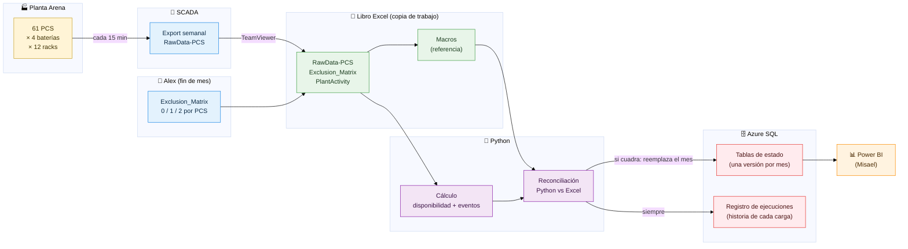
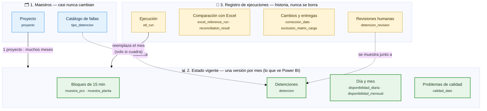
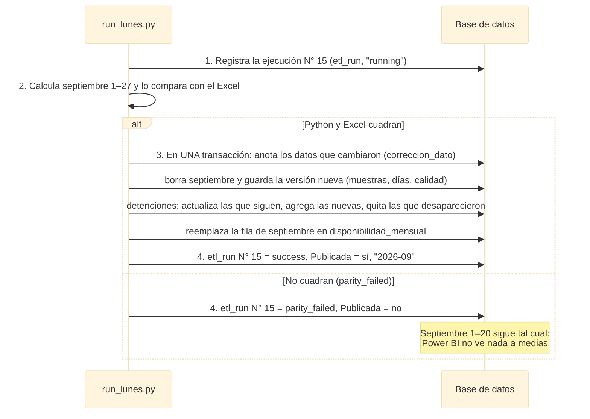
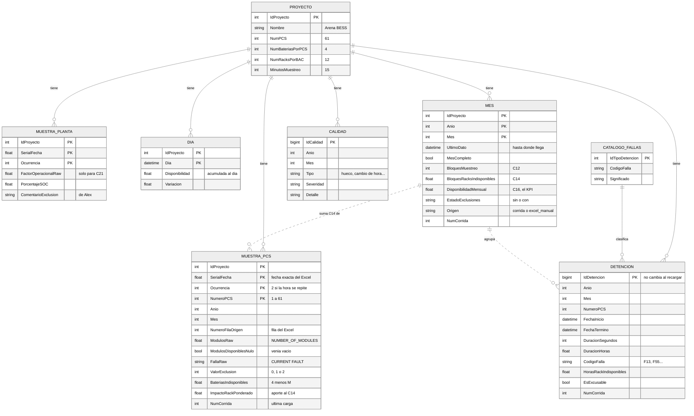
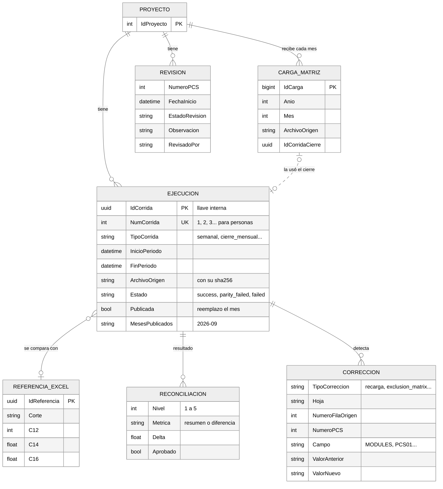
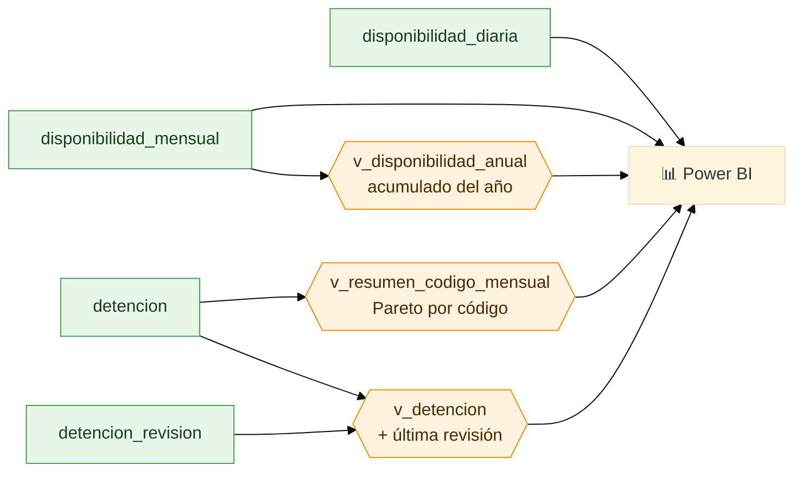

# Modelo conceptual de datos

Para: cualquiera que quiera entender **qué se guarda en la base de datos y por qué**, sin leer SQL.
Las palabras técnicas están en el [glosario](./glosario.md). El detalle exacto de cada tabla está en `sql/02_corrida.sql`.

> **La idea en una frase:** la base guarda **una sola versión vigente de cada mes**. Cuando se vuelve a cargar un
> mes (por ejemplo, el lunes siguiente con más días), sus datos **se reemplazan**: no se acumulan copias. Aparte, un
> **registro de ejecuciones** anota cada carga (cuándo, qué archivo, si cuadró con el Excel y qué datos cambiaron).
> Decisión: [ADR-12](./adr/ADR-12-estado-vigente.md).

Los diagramas se ven como dibujos en GitHub y en VS Code (con la extensión *Markdown Preview Mermaid Support*).

Este modelo existe **igual en las dos bases** del servidor `trina-etl.database.windows.net`: **PROD** (`trina_etl`, lo oficial) y **TEST/QA** (`trina_etl_prueba`, para practicar). Ver el [README](../README.md#las-dos-bases-de-datos-prod-y-testqa).

---

## 1. El viaje de un dato

Desde que un PCS informa cuántas baterías tiene, hasta que aparece en el reporte de Power BI:

---

## 2. El mapa general: tres cajones

Piensa en la base de datos como **tres cajones**:

1. **Maestros**: lo que casi nunca cambia (la planta y el catálogo de fallas).
2. **Estado vigente**: lo que Power BI muestra. **Una sola versión por mes**; se reemplaza al recargar ese mes.
3. **Registro de ejecuciones**: la historia. Una fila por cada carga y lo que pasó en ella. Nunca se borra.

### Cómo funciona una recarga

Ejemplo: el lunes 21 se cargó septiembre del 1 al 20. El lunes 28 se vuelve a correr septiembre del 1 al 27.

Si algo falla a mitad de la transacción, **nada** cambia: el mes anterior queda intacto.

---

## 3. El detalle de cada cajón (modelo entidad-relación)

Cómo leer las "patitas" de las líneas:

| Símbolo | Se lee |
|---|---|
| `\|\|` | exactamente uno |
| `o\|` | cero o uno |
| `o{` | cero o muchos |
| `\|{` | uno o muchos |
| línea punteada | relación de negocio (no es una llave directa en la base) |

### 3.1 El estado vigente (lo que lee Power BI)

Cada fila se identifica por **qué es** (proyecto, fecha, PCS), no por qué carga la escribió. Por eso al recargar se
reemplaza en vez de duplicarse. La columna `NumCorrida` solo dice qué ejecución la escribió por última vez.

### 3.2 El registro de ejecuciones (la historia)

Aquí nada se borra ni se reemplaza. Sirve para responder *¿quién cargó qué, cuándo, y qué cambió?*

## 4. Cada concepto, en una línea

### 🗂️ 1. Maestros — lo que casi nunca cambia

| Concepto | Tabla | Qué guarda |
|---|---|---|
| Proyecto | `proyecto` | Cada planta con sus números: Arena = 61 PCS, 4 baterías, 12 racks, 15 min. (Hay 3 plantas más registradas, aún sin datos.) |
| Catálogo de fallas | `tipo_detencion` | Los códigos de falla de `PCS-Fault` (F0…F257) con su significado. |

### 📊 2. Estado vigente — una versión por mes

| Concepto | Tabla | Qué guarda |
|---|---|---|
| Bloque de un PCS | `muestra_pcs` | Una fila por **bloque de 15 minutos y PCS**: el dato crudo de SCADA (`NUMBER_OF_MODULES`, falla, estado), la exclusión aplicada y **cuánto aportó al C14**. |
| Bloque de la planta | `muestra_planta` | Una fila por bloque: lo de `PlantActivity` (solo influye si C21 = "Yes") y el comentario de la `Exclusion_Matrix`. |
| Detención | `detencion` | Cada evento de falla (`ListOfFaults`): PCS, inicio, fin, duración en **segundos** y en **horas**, código, horas-rack perdidas. Su `IdDetencion` **no cambia** al recargar. |
| Día | `disponibilidad_diaria` | La curva diaria (`Daily`): disponibilidad acumulada hasta cada día y su variación. |
| Mes | `disponibilidad_mensual` | **Una fila por mes** con los números clave: C12, C14, **C16 (el KPI)**, C19, L10, hasta qué dato llega, si está completo y si es "Sin" o "Con Exclusiones". Julio y agosto 2026 vienen del Excel (`excel_manual`). |
| Problema de calidad | `calidad_dato` | Cosas raras en los datos del mes: huecos, duplicados, cambio de hora, módulos vacíos, códigos desconocidos… |

### 🧾 3. Registro de ejecuciones — la historia

| Concepto | Tabla | Qué guarda |
|---|---|---|
| Ejecución | `etl_run` | **Una fila por cada carga**: período, tipo, archivo leído (con su huella sha256), cómo terminó, si **publicó** y qué meses. |
| Referencia Excel | `excel_reference_run` | Los KPI que calculó el Excel con sus macros (C12, C14, C16, C19). El detalle completo queda en `referencia_excel.json` del corte. |
| Reconciliación | `reconciliation_result` | La comparación Python vs Excel: un resumen por nivel y solo las diferencias que no cuadraron. |
| Corrección | `correccion_dato` | Cada dato que **cambió** respecto de la versión anterior del mes: al recargar (`recarga`) o al cargar la matriz (`exclusion_matrix`). Valor antes y después. |
| Carga de la matriz | `exclusion_matrix_carga` | Cada entrega mensual de Alex: qué archivo, cuándo y qué cierre la usó. |
| Revisión | `detencion_revision` | Lo que una persona anota al revisar una detención. Se conserva aunque el mes se recargue. |

Cada ejecución tiene **dos identificadores**:

| Campo | Ejemplo | Para qué |
|---|---|---|
| `NumCorrida` | `12` | Para **personas**: "revisa la ejecución 12". Correlativo 1, 2, 3… que asigna la base |
| `IdCorrida` | `4d763e71-a9d5-…` | Para el **sistema**: se crea en Python antes de tocar la base (logs, carpeta del corte) |

**Misael no necesita ninguno de los dos**: las tablas de estado ya tienen solo la versión vigente de cada mes.

---

## 5. Las reglas que el modelo siempre cumple

1. **Una sola versión por mes.** Recargar un mes lo reemplaza entero; nunca quedan filas repetidas.
2. **Solo se publica lo que cuadra.** Si Python y el Excel no coinciden (`parity_failed`), el mes vigente no se toca.
3. **Todo o nada.** El reemplazo de un mes ocurre en una sola transacción: Power BI nunca ve un mes a medias.
4. **Protecciones.** No se borra por accidente: una carga que llega a una fecha **anterior** a lo vigente, un mes
   importado del Excel (`excel_manual`) o un mes "Con Exclusiones" solo se reemplazan con una opción explícita
   (`--permitir-recorte`, `--reemplazar-manual`, `--forzar-sin-exclusiones`).
5. **La historia no se pierde.** El registro de ejecuciones nunca se borra, y cada dato que cambia entre cargas queda
   en `correccion_dato` con su valor anterior.
6. **Las revisiones sobreviven.** Una detención conserva su `IdDetencion` y su revisión aunque el mes se recargue.
7. **Los datos raros no se esconden**: los `NUMBER_OF_MODULES` vacíos se cuentan como disponibles (igual que el
   Excel), pero quedan marcados y listados.
8. **Fechas en `DATETIME`** y además el número de serie original del Excel, para no perder precisión.

## 6. Lo que ve Power BI

Power BI lee **directo las tablas de estado** (ya tienen solo lo vigente) y unas pocas vistas que suman o juntan:

Vistas de control: `v_modulos_nulos` (bloques sin dato de módulos), `v_correccion_dato` (qué datos cambiaron y en
qué carga) y `v_ejecuciones` (el registro de cargas). Detalle para Power BI en [`pbi-handoff.md`](./pbi-handoff.md).

## 7. Ejemplo: seguir un número hacia atrás

*"¿Por qué septiembre dio C14 = 104.134,292?"*

1. `disponibilidad_mensual` (2026, 9) → **C14 = 104.134,292**, escrito por la ejecución `NumCorrida` 15.
2. `muestra_pcs` de septiembre → la suma de `ImpactoRackPonderado` de todos sus bloques y PCS da exactamente ese
   número. Se puede ver qué PCS y qué días aportaron más.
3. En esas mismas filas está el `NUMBER_OF_MODULES` que informó SCADA (`ModulosRaw`) y la fila del Excel
   (`NumeroFilaOrigen`).
4. `v_ejecuciones` con `NumCorrida = 15` dice qué archivo se leyó (con su sha256) y si cuadró con el Excel; y
   `v_correccion_dato` muestra qué datos habían cambiado respecto de la carga anterior.

Las consultas listas para hacer este recorrido están en `sql/07_audit_queries.sql`.
