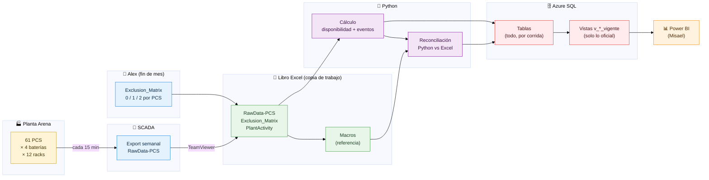
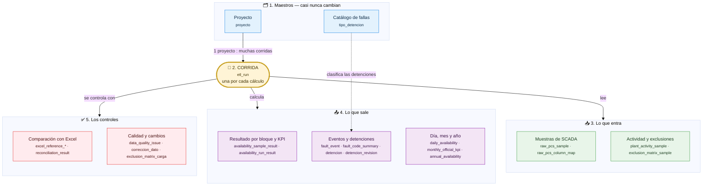
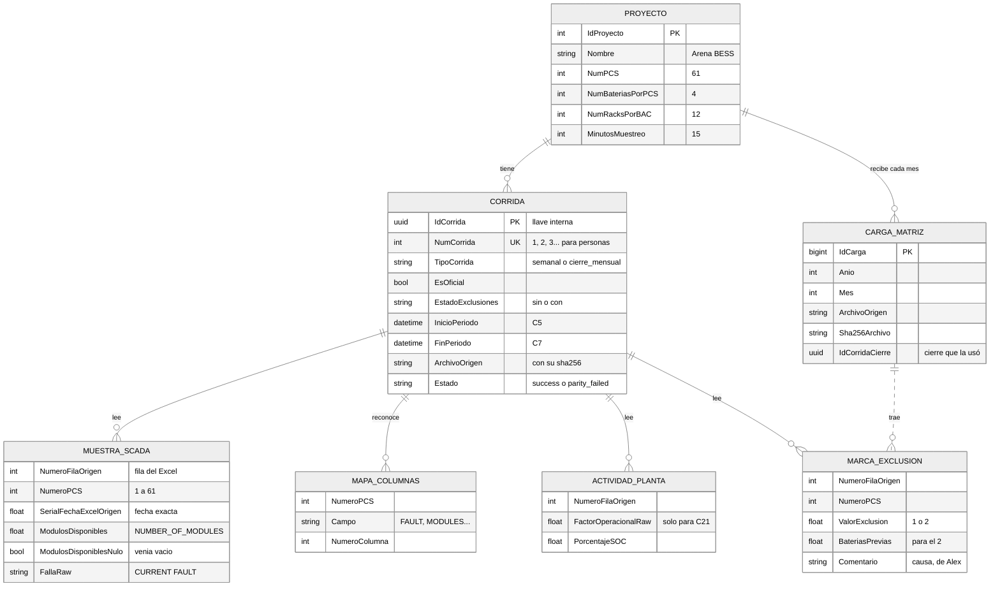
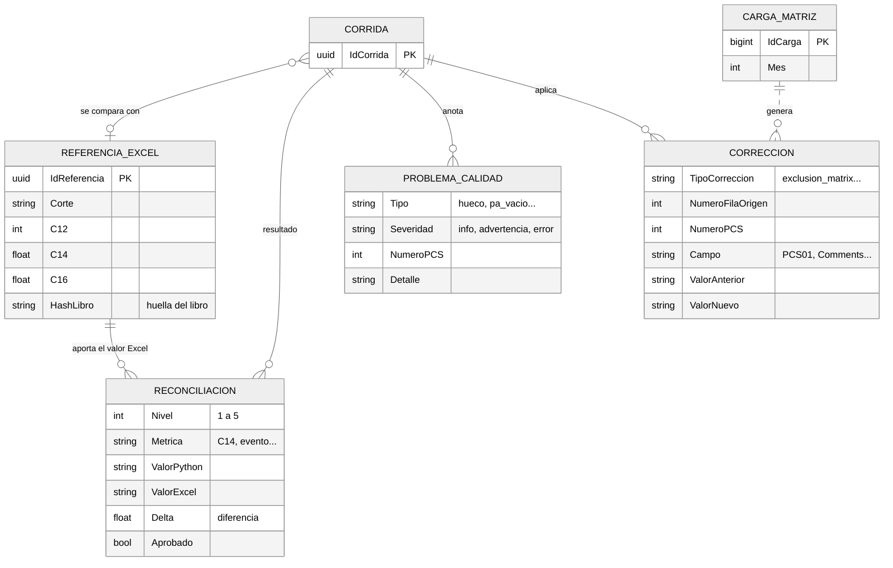
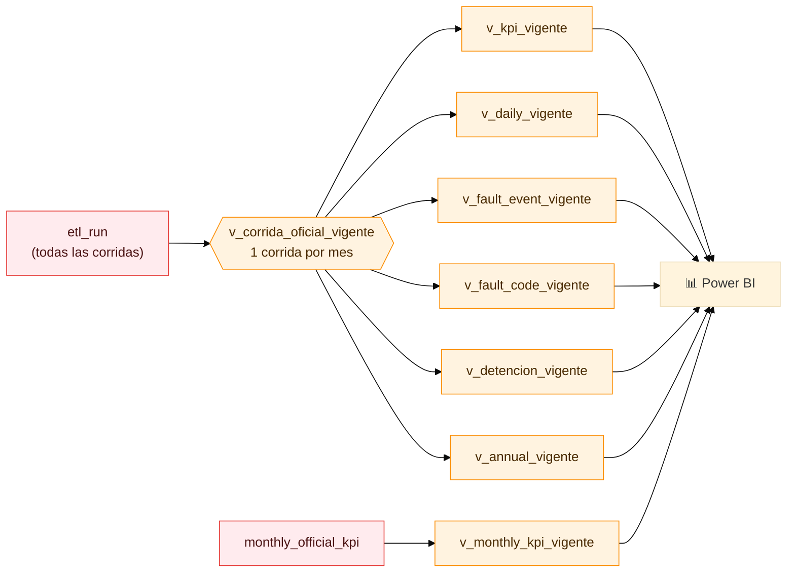

# Modelo conceptual de datos

Para: cualquiera que quiera entender **qué se guarda en la base de datos y por qué**, sin leer SQL.
Las palabras técnicas están en el [glosario](./glosario.md). El detalle exacto de cada tabla está en `sql/02_corrida.sql`.

> **La idea en una frase:** cada vez que se calcula la disponibilidad se crea una **corrida**. Todo lo que entra
> (datos de SCADA, exclusiones), todo lo que sale (KPI, eventos, días, meses) y todos los controles (comparación con
> el Excel, problemas de calidad) quedan **colgando de esa corrida**, y nunca se borran.

Los diagramas se ven como dibujos en GitHub y en VS Code (con la extensión *Markdown Preview Mermaid Support*).

Este modelo existe **igual en las dos bases** del servidor `trina-etl.database.windows.net`: **PROD** (`trina_etl`, lo oficial) y **TEST/QA** (`trina_etl_prueba`, para practicar). Ver el [README](../README.md#las-dos-bases-de-datos-prod-y-testqa).

---

## 1. El viaje de un dato

Desde que un PCS informa cuántas baterías tiene, hasta que aparece en el reporte de Power BI:

---

## 2. El mapa general: cinco cajones

Piensa en la base de datos como **cinco cajones**. En el centro está la **corrida**: todo lo demás se cuelga de ella.
Cada caja agrupa **conceptos** ("cosas" que guardamos); en letra chica, las tablas donde viven.

## 3. El detalle de cada cajón (modelo entidad-relación)

Estos diagramas muestran los datos principales de cada concepto. Cómo leer las "patitas" de las líneas:

| Símbolo | Se lee |
|---|---|
| `\|\|` | exactamente uno |
| `o\|` | cero o uno |
| `o{` | cero o muchos |
| `\|{` | uno o muchos |
| línea punteada | relación de negocio (no es una llave directa en la base) |

### 3.1 La corrida y lo que entra

Una corrida lee el libro Excel y guarda **lo que vio**: cada muestra de SCADA, la actividad de planta y las marcas de
exclusión, siempre con la fila del Excel de donde salió (`NumeroFilaOrigen`).

### 3.2 Lo que sale

Con esos datos la corrida calcula el resultado de cada bloque, el KPI, los eventos y las tablas diaria, mensual y
anual.

```mermaid
%%{init: {'theme':'neutral'}}%%
erDiagram
    CORRIDA ||--o{ RESULTADO_MUESTRA : "calcula"
    CORRIDA ||--|| KPI_CORRIDA : "resume en"
    CORRIDA ||--o{ EVENTO_FALLA : "detecta"
    CORRIDA ||--o{ RESUMEN_CODIGO : "agrupa"
    CORRIDA ||--o{ DIA : "calcula"
    CORRIDA |o--o| KPI_MENSUAL : "registra si es oficial"
    CORRIDA ||--o{ ACUMULADO_ANUAL : "calcula"
    CORRIDA ||--o{ DETENCION : "publica"
    CATALOGO_FALLAS ||--o{ DETENCION : "clasifica"
    DETENCION ||..o{ REVISION : "se revisa en"

    CORRIDA {
        uuid IdCorrida PK
    }
    RESULTADO_MUESTRA {
        int NumeroPCS
        datetime MarcaTiempoMuestra
        float BateriasIndisponibles "4 menos M"
        float ValorExclusion "0, 1 o 2"
        float ImpactoRackPonderado "aporte al C14"
    }
    KPI_CORRIDA {
        int BloquesMuestreo "C12"
        float BloquesRacksIndisponibles "C14"
        float DisponibilidadPeriodo "C16, el KPI"
        float DisponibilidadAnualAcumulada "C19"
        float HorasRackEventos "L10"
    }
    EVENTO_FALLA {
        int NumeroPCS
        datetime MarcaTiempoInicio
        datetime MarcaTiempoFin
        float DuracionHoras
        string CodigoFalla "F13, F55..."
        float HorasRackIndisponibles
        bool TieneExclusion
    }
    RESUMEN_CODIGO {
        int Ranking
        string CodigoFalla
        float HorasRackIndisponibles
        float Porcentaje
    }
    DIA {
        int DiaN "1 a 31"
        datetime Dia
        float Disponibilidad "acumulada al dia"
        float Variacion
    }
    KPI_MENSUAL {
        int Anio
        int Mes
        float BloquesRacksIndisponibles
        string Origen "corrida o excel_manual"
    }
    ACUMULADO_ANUAL {
        int Mes
        float DisponibilidadMensual
        float DisponibilidadAcumulada "KPI del año"
        float DisponibilidadContractual "0,98"
    }
    CATALOGO_FALLAS {
        int IdTipoDetencion PK
        string CodigoFalla
        string Significado
    }
    DETENCION {
        bigint IdDetencion PK
        int NumeroPCS
        datetime FechaInicio
        datetime FechaTermino
        int DuracionSegundos
        float DuracionHoras "misma duración en horas"
        bool EsExcusable
    }
    REVISION {
        int NumeroPCS
        datetime FechaInicio
        string EstadoRevision
        string Observacion
        string RevisadoPor
    }
```

### 3.3 Los controles

Cada corrida se compara con el Excel y deja anotado todo lo raro y todo lo que se corrigió.

## 4. Cada concepto, en una línea

### 🗂️ 1. Maestros — lo que casi nunca cambia

| Concepto | Tabla | Qué guarda |
|---|---|---|
| Proyecto | `proyecto` | Cada planta con sus números: Arena = 61 PCS, 4 baterías, 12 racks, 15 min. (Hay 3 plantas más registradas, aún sin datos.) |
| Catálogo de fallas | `tipo_detencion` | Los códigos de falla de `PCS-Fault` (F0…F257) con su significado. |

### 🧾 2. La corrida — el centro de todo

| Concepto | Tabla | Qué guarda |
|---|---|---|
| Corrida | `etl_run` | **Un registro por cada cálculo**: qué período, qué tipo (semanal / cierre mensual), si es oficial, si es "Sin" o "Con Exclusiones", los interruptores usados (C21, C31, L14), qué archivo se leyó (con su huella sha256), si terminó bien y qué versión del algoritmo se usó. |

Todo lo demás se "cuelga" de la corrida con su `IdCorrida`. Así se puede responder siempre: *¿de dónde salió este
número?*

Cada corrida tiene **dos identificadores**:

| Campo | Ejemplo | Para qué |
|---|---|---|
| `NumCorrida` | `12` | Para **personas**: "revisa la corrida 12". Correlativo 1, 2, 3… que asigna la base al guardar |
| `IdCorrida` | `4d763e71-a9d5-…` | Para el **sistema**: la llave que une todas las tablas |

¿Por qué no basta con el número? `IdCorrida` se crea en Python **antes** de tocar la base (lo usan los logs, la
carpeta del corte y los ensayos sin base de datos), y nunca se repite aunque haya varios computadores y dos bases
(PROD y TEST/QA). Un número, en cambio, solo existe después de guardar y se repite entre bases: la corrida 12 de
TEST/QA no es la corrida 12 de PROD.

### 📥 3. Lo que entra

| Concepto | Tabla | Qué guarda |
|---|---|---|
| Muestra de SCADA | `raw_pcs_sample` | Una fila por **bloque de 15 minutos y PCS**: el `NUMBER_OF_MODULES` tal como vino, el código de falla, el estado, y de qué fila del Excel salió. |
| Mapa de columnas | `raw_pcs_column_map` | En qué columna del Excel estaba cada dato de cada PCS (para auditar). |
| Actividad de planta | `plant_activity_sample` | Lo de `PlantActivity`. Solo influye si C21 = "Yes". |
| Marca de exclusión | `exclusion_matrix_sample` | Solo las celdas marcadas con **1 o 2** en la `Exclusion_Matrix`, con el comentario de Alex. |
| Carga de la matriz | `exclusion_matrix_carga` | Cada vez que Alex entrega la matriz de un mes: qué archivo, cuándo y qué cierre mensual la usó (`IdCorridaCierre`). |

### 📤 4. Lo que sale

| Concepto | Tabla | Qué guarda |
|---|---|---|
| Resultado por muestra | `availability_sample_result` | Para cada bloque y PCS: cuántas baterías faltaban, si había exclusión y **cuánto aportó al C14**. |
| KPI de la corrida | `availability_run_result` | **Una fila por corrida** con los números clave: C12, C14, **C16 (el KPI)**, C19 y L10. |
| Evento de falla | `fault_event` | La lista de eventos (`ListOfFaults`): PCS, inicio, fin, duración, código, horas-rack perdidas. |
| Resumen por código | `fault_code_summary` | Horas-rack perdidas por cada código de falla, ordenadas (el "Pareto"). |
| Día | `daily_availability` | La curva diaria (`Daily`): disponibilidad acumulada hasta cada día y su variación. |
| KPI mensual | `monthly_official_kpi` | El número oficial de cada mes. Julio y agosto 2026 vienen del Excel (`excel_manual`). |
| Acumulado anual | `annual_availability` | La tabla `Annual_AVA`: cada mes y la **disponibilidad acumulada del año** contra el 98 % contractual. |
| Detención | `detencion` | Los eventos listos para operación, con su tipo del catálogo y la duración en **segundos** (`DuracionSegundos`) y en **horas** (`DuracionHoras`). |
| Revisión | `detencion_revision` | Lo que una persona anota al revisar una detención (estado, observación, quién y cuándo). Se conserva aunque el mes se recalcule. |

### ✅ 5. Los controles

| Concepto | Tabla | Qué guarda |
|---|---|---|
| Referencia Excel | `excel_reference_run` (+ `_sample`, `_fault_event`, `_daily`) | Lo que calculó el Excel con sus macros para el mismo período. |
| Reconciliación | `reconciliation_result` | La comparación Python vs Excel en 5 niveles, con la diferencia (`Delta`) de cada número. |
| Problema de calidad | `data_quality_issue` | Cosas raras en los datos: huecos, duplicados, cambio de hora, módulos vacíos, códigos desconocidos… |
| Corrección | `correccion_dato` | Cada celda que cambió por una carga de la matriz o una corrección: valor antes y después. |

---

## 5. Las reglas que el modelo siempre cumple

1. **Nunca se borra nada** (*append-only*). Si algo se recalcula, se crea una corrida nueva y la anterior queda como historia.
2. **Todo tiene dueño**: cada dato calculado apunta a su corrida (`IdCorrida`), y cada corrida a su archivo de origen (con su sha256).
3. **Se puede auditar hacia atrás**: KPI → aporte de cada bloque → dato crudo de SCADA → fila y columna del Excel.
4. **Una sola verdad por mes para Power BI**: las vistas eligen la corrida vigente (oficial, terminada bien, y
   "Con Exclusiones" si existe).
5. **Los datos raros no se esconden**: los `NUMBER_OF_MODULES` vacíos se cuentan como disponibles (igual que el
   Excel), pero quedan marcados y listados.
6. **Fechas en `DATETIME`** y además el número de serie original del Excel, para no perder precisión.

## 6. Lo que ve Power BI: las vistas

Power BI **no lee las tablas**: lee **vistas**, que ya eligen lo oficial. Así el reporte nunca se equivoca de corrida.

Además hay vistas de control: `v_calidad_corrida` (salud de cada corrida), `v_modulos_nulos_historico`
(bloques sin dato de módulos) y `v_correccion_dato` (qué celdas cambiaron). Detalle para Power BI en
[`pbi-handoff.md`](./pbi-handoff.md).

## 7. Ejemplo: seguir un número hacia atrás

*"¿Por qué septiembre 1–21 dio C14 = 104.134,292?"*

1. `availability_run_result` de la corrida vigente de septiembre → **C14 = 104.134,292**.
2. `availability_sample_result` de esa corrida → la suma de `ImpactoRackPonderado` de todos sus bloques y PCS da
   exactamente ese número. Se puede ver qué PCS y qué días aportaron más.
3. `raw_pcs_sample` → para cualquiera de esos bloques, el `NUMBER_OF_MODULES` que informó SCADA.
4. `NumeroFilaOrigen` y `raw_pcs_column_map` → la fila y la columna exactas del libro Excel, y `etl_run` dice qué
   archivo era (con su sha256).

Las consultas listas para hacer este recorrido están en `sql/07_audit_queries.sql`.
