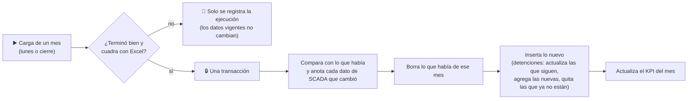

# Plan — Base de datos con un solo estado vigente (recarga por período)

Para: Francisco (decisión) y quien implemente la Fase 6. Estado: **aprobado 2026-09-26** (decisiones D-20 a D-27 resueltas en [decisiones abiertas](./adr/decisiones-abiertas.md)). Decisión de arquitectura:
[ADR-12](./adr/ADR-12-estado-vigente.md). Palabras técnicas: [glosario](./glosario.md).

---

## 1. Cómo funciona hoy

- El lunes, `run_lunes.py` calcula un **período** con un **desde–hasta configurable**:
  - por defecto, desde el **día 1 del mes** del último dato hasta **ese último dato** (D-07);
  - a mano: `--desde 2026-09-01 --hasta 2026-09-21`.
- Cada ejecución crea una **corrida** (`IdCorrida` / `NumCorrida`) y guarda **una copia completa** de todo lo que
  calculó: las ~180.000 muestras de 15 minutos del mes, sus resultados, las detenciones, el día a día, los KPI.
- Las vistas `v_*_vigente` eligen, para cada mes, la última corrida oficial, y Power BI lee esas vistas.

**El problema:** si septiembre se calcula 4 lunes seguidos, la base guarda **4 copias** de las primeras semanas,
4 versiones de cada detención y 4 KPI de septiembre. Funciona para Power BI (la vista elige la última), pero las
tablas se vuelven difíciles de usar directamente y crecen sin necesidad.

## 2. Lo que se pide

> Al cargar un período, **reemplazar** lo que ya había de ese período (muestras de 15 minutos, detenciones,
> disponibilidad, etc.) en vez de agregar una copia nueva. Una sola tabla simple por tema, sin que Misael tenga que
> saber de corridas.

## 3. Validación: sí, con cuatro ajustes

La idea es correcta y más simple de operar. Pero hay cuatro cosas que, si no se cuidan, romperían la paridad con el
Excel o la auditoría:

| # | Riesgo | Ajuste propuesto |
|---|---|---|
| 1 | **Las detenciones dependen de dónde empieza el período.** El Excel corta cada falla en el borde del período (una falla que viene del 31 de agosto "empieza" el 1 de septiembre). Si se recargara desde el 10 de septiembre, las fallas que cruzan el día 10 quedarían partidas en dos y ya no coincidirían con el Excel. | **La unidad de recarga es el mes** (D-20). El "desde" se ajusta al día 1 del mes; un rango de varios meses se procesa mes por mes. |
| 2 | **Una recarga más corta borraría datos.** Si la base ya tiene hasta el 21 y se recarga "hasta el 14", del 15 al 21 desaparecería. | Se detiene y pide `--permitir-recorte` (D-21). |
| 3 | **Un cálculo que no cuadra con el Excel pisaría datos buenos.** | Solo reemplaza una carga que terminó bien. Si no cuadra con Excel, queda registrada pero **no toca** los datos vigentes (D-22). |
| 4 | **Se pierde la historia** ("¿qué decía la base antes de la corrección?"). | Se guarda lo mínimo útil (D-24): un registro por ejecución y **cada valor de SCADA que cambió** al recargar (antes → después), como pediste para las correcciones (D-13). |

Además hay que proteger dos casos (D-23): los meses importados a mano del Excel (julio y agosto) y los meses ya
cerrados "Con Exclusiones" no se reemplazan por accidente.

## 4. Cómo quedará

**Ejemplo:** el lunes 28-09 se carga septiembre (1 al 27). La base ya tenía septiembre del 1 al 21:

| Tabla | Antes | Después |
|---|---|---|
| Muestras de 15 minutos de septiembre | del 1 al 21 | del 1 al 27 (las del 1 al 21 se reescriben; si SCADA corrigió alguna, queda anotada) |
| Detenciones de septiembre | las del 1 al 21 | las del 1 al 27: las que seguían abiertas el 21 se **actualizan** (mismo `IdDetencion`), aparecen las nuevas |
| KPI de septiembre | 1 fila (hasta el 21) | la **misma fila**, ahora hasta el 27 |
| Registro de ejecuciones | corrida 5 | corrida 5 y corrida 6 (solo una línea cada una) |

## 5. Las tablas nuevas (más simples)

Las 14 tablas que hoy se copian por corrida quedan en **6 tablas de estado vigente** y 3 vistas:

| Tabla nueva | Reemplaza a | Una fila por… |
|---|---|---|
| `muestra_pcs` | `raw_pcs_sample` + `availability_sample_result` + `exclusion_matrix_sample` | bloque de 15 minutos y PCS: dato de SCADA, exclusión y aporte al KPI |
| `muestra_planta` | `plant_activity_sample` + fila de `Exclusion_Matrix` | bloque de 15 minutos: actividad de planta y comentario de la exclusión |
| `detencion` | `fault_event` + `detencion` | falla (PCS + inicio): duración en segundos y horas, código, horas-rack |
| `disponibilidad_diaria` | `daily_availability` | día |
| `disponibilidad_mensual` | `availability_run_result` + `monthly_official_kpi` | mes: C12, C14, disponibilidad, "Sin/Con Exclusiones", hasta qué dato llega, si está cerrado |
| `calidad_dato` | `data_quality_issue` | anomalía vigente del mes |

| Vista | Qué muestra |
|---|---|
| `v_disponibilidad_anual` | El acumulado del año (hoja `Annual_AVA`), calculado desde `disponibilidad_mensual` |
| `v_resumen_codigo_mensual` | Horas-rack por código de falla y mes (el "Pareto"), desde `detencion` |
| `v_detencion` | Detenciones con su última revisión |

**Se mantienen como registro** (solo agregan, nunca se borran): `etl_run` (una línea por ejecución), `correccion_dato`
(cada dato que cambió), `exclusion_matrix_carga` (entregas de Alex), `detencion_revision` (revisiones de las personas),
y de la comparación con Excel solo sus KPI (`excel_reference_run`) y las diferencias (`reconciliation_result`). El
detalle completo de la referencia Excel queda en el archivo `referencia_excel.json` de cada corte.

**Se eliminan:** `raw_pcs_column_map`, `fault_code_summary`, `annual_availability`,
`excel_reference_sample` / `_fault_event` / `_daily` y las vistas `v_*_vigente`.

Cada fila vigente guarda `NumCorrida`: la carga que la escribió por última vez. Así cualquier dato se puede rastrear
hasta su archivo de origen (vía `etl_run`), sin copias.

## 6. Cambios para quien opera

- El período se indica con `--desde` / `--hasta` (antes `--periodo-inicio` / `--periodo-fin`). Si `--desde` no es día 1, se ajusta al día 1 y se avisa.
  Si el rango abarca varios meses (por ejemplo, todo agosto y septiembre), se cargan uno tras otro.
- `--oficial` deja de ser necesario: en PROD toda carga que termina bien publica. Para practicar se usa TEST/QA
  (`--entorno prueba`) o `--sin-bd`.
- Opciones nuevas, solo para casos especiales: `--permitir-recorte`, `--publicar-aunque-no-cuadre`,
  `--reemplazar-manual`.
- **Correcciones de SCADA:** basta volver a cargar el mes con el export corregido. Lo que cambió queda en
  `correccion_dato`. El "reproceso" deja de ser una etapa aparte (tarea 4.13 absorbida).

## 7. Qué cambia para Misael (Power BI)

Lee **directamente** `disponibilidad_mensual`, `disponibilidad_diaria` y `v_detencion` (más las vistas de anual y
Pareto). Cada mes tiene **una sola fila**, cada detención aparece **una sola vez**, y no hay que saber nada de corridas.

## 8. Plan de implementación (Fase 6 del SDD)

| Paso | Tarea | Quién |
|---|---|---|
| 6.0 | Aprobar D-20 a D-27 y ADR-12 | Francisco |
| 6.1 | Esquema v2: 6 tablas de estado, vistas, roles (`etl_writer` puede borrar solo en tablas de estado), script de migración | database-optimizer |
| 6.2 | Persistencia: carga por mes en una transacción (bloqueo, diferencias, borrar/insertar, detenciones por clave, KPI mensual) | backend-architect |
| 6.3 | Ejecución y orquestador: ajuste al día 1, varios meses, protecciones, no publicar si no cuadra, fuera `--oficial` | backend-architect |
| 6.4 | Reconciliación y referencia Excel reducidas | data-engineer |
| 6.5 | Notificación, shadow log, verificador y calidad por mes | backend-architect |
| 6.6 | Pruebas: recargar dos veces da lo mismo; corrección anotada; detención actualizada con el mismo id; revisiones conservadas; protecciones; parity_failed no publica | parity-qa |
| 6.7 | Documentación (modelo de datos, Power BI, guía del lunes, glosario, README, CLAUDE, AGENTS) | technical-writer |
| 6.8 | Migrar: PROD (vacía) al esquema v2; TEST/QA recargada con agosto y septiembre | Claude + Francisco |
| — | Checkpoint E (revisión de código) | code-reviewer |

No cambia el cálculo: los motores y la paridad con Excel siguen iguales. Cambia solo **cómo se guarda**.
