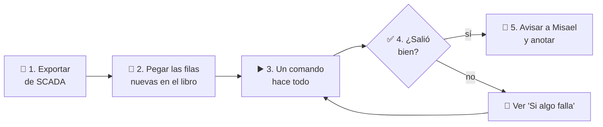

# Guía del lunes — cómo calcular la disponibilidad cada semana

Para: quien hace la corrida semanal (Francisco / Alex). Si una palabra no se entiende, está en el
[glosario](./glosario.md). Si el computador es nuevo, primero sigue la [guía de instalación](./instalacion.md).

**Cuándo:** cada lunes, después de que SCADA tenga los datos de la semana.
**Cuánto tarda:** unos 15 minutos de trabajo y ~5 minutos de espera.
**Dónde:** siempre en el **mismo computador** (el "oficial"), dentro de la carpeta del proyecto, en PowerShell.

---

## El lunes en un dibujo



## Reglas de oro

1. **En el server SCADA solo se exporta.** Nunca se corre nada allí.
2. **Los originales no se tocan.** El programa siempre trabaja sobre **copias** (carpeta `data/work/`).
3. **Nada se borra de la base de datos.** Cada cálculo queda guardado como una corrida con su número (`NumCorrida`: 1, 2, 3…) y su código interno (`IdCorrida`).
4. **Las exclusiones salen solo de la `Exclusion_Matrix`** que entrega Alex a fin de mes. `PlantActivity` no se
   usa para exclusiones mientras Alex no lo confirme.
5. **Mientras el programa usa Excel, no uses Excel** (se abre una ventana sola por menos de 1 minuto y se cierra sola).

---

## Antes de empezar (1 minuto)

- [ ] Estás en el computador oficial, en la carpeta del proyecto (`cd C:\dev\ETL_Arena` o donde esté).
- [ ] La carpeta `data\inbox\` está vacía.
- [ ] (Recomendado) La revisión automática da todo OK:
  ```powershell
  .venv\Scripts\python scripts\verificar_entorno.py --sin-excel
  ```

## Paso 1 — Exportar los datos de SCADA

1. Conéctate por **TeamViewer** al server SCADA.
2. Abre el reporte de exportación de `RawData-PCS`.
3. Pon las fechas:
   - **DESDE** = el dato siguiente al último que ya está en el libro. (Ejemplo: si el último dato cargado es
     21-09-2026 14:15, desde 21-09-2026 14:30.)
   - **HASTA** = el último dato disponible hoy.
4. Exporta y copia el archivo por TeamViewer a esta PC, en `data\inbox\`, con el nombre
   `raw_pcs_AAAA-MM-DD.<extensión>` (la fecha de hoy).

> ¿Cuál es "el último dato cargado"? Está al final de la hoja `RawData-PCS` del **libro base**. El programa
> anota cuál es el libro base en `data\work\libro_base.json` (campo `ruta`). La primera vez es el libro de `data\`.

## Paso 2 — Pegar las filas nuevas en el libro (a mano, por ahora)

Mientras no tengamos la muestra real del export de SCADA (tarea 0.6), las filas nuevas se pegan a mano:

1. Copia el **libro base** y guárdalo como `data\work\AAAA-MM-DD-preparado.xlsm` (la fecha de hoy).
2. Ábrelo y pega las filas nuevas **al final** de la hoja `RawData-PCS`. **No cambies ninguna fila existente.**
3. Revisa la columna A (fecha y hora): debe verse **alineada a la derecha** (es una fecha de verdad). Si está a la
   izquierda, es texto y el cálculo fallará: corrígelo antes de seguir.
4. Guarda y **cierra Excel**.

## Paso 3 — Un comando hace todo

Cambia la fecha (dos veces) y ejecuta:

```powershell
.venv\Scripts\python scripts\run_lunes.py --stage all --corte 2026-09-28 --libro-preparado "data\work\2026-09-28-preparado.xlsm" --oficial
```

Qué significa cada parte:

| Parte | Significa |
|---|---|
| `--stage all` | Hacer todas las etapas, una tras otra |
| `--corte 2026-09-28` | El nombre de esta corrida (usa la fecha de hoy). Crea la carpeta `data\work\2026-09-28\` |
| `--libro-preparado "…"` | El libro que preparaste en el paso 2 |
| `--oficial` | El resultado es oficial y lo podrá ver Power BI |

El programa va mostrando cada etapa. Esto es lo que hace cada una:

| Etapa | En palabras simples |
|---|---|
| `acquire-wait` | Busca el export en `data\inbox\`, revisa que no esté vacío, le saca una "huella" (sha256) y lo guarda para siempre en `data\processed\` |
| `prepare-workbook` | Hace una copia del libro preparado para trabajar sobre ella (y otra copia de respaldo `.bak`) |
| `run-macros` | Abre Excel, escribe las fechas, corre las macros y anota los resultados de Excel |
| `run-etl` | Python calcula todo por su cuenta, lo compara con Excel y lo guarda en la base de datos |
| `reconcile` | Decide si se puede publicar: si Python y Excel no coinciden, se detiene |
| `notify-bi` | Prepara el aviso para Misael |

**Qué período calcula:** desde el **día 1 del mes** hasta el **último dato** (así lo pide el contrato).
Los resultados semanales salen con la etiqueta **"Sin Exclusiones"**, porque la matriz de exclusiones de Alex llega
a fin de mes. Igual son oficiales.

## Paso 4 — ¿Salió bien?

**Mira la última línea.** Si todas las etapas dicen `ok` y PowerShell no muestra `ERROR`, salió bien.

Para saber más, abre `data\work\<corte>\run_state.json` con el Bloc de notas. En `run-etl` busca:

| Dato | Qué debe decir | Qué significa |
|---|---|---|
| `"num_corrida"` | un número, por ejemplo `12` | El número de esta corrida en la base (úsalo al hablar de ella) |
| `"estado"` | `success` | El cálculo terminó bien |
| `"reconciliacion" → "estado"` | `pass` | Python y Excel dan **exactamente** lo mismo |
| `"kpi" → "C16"` | un número como `0.98` | La disponibilidad del período (0,98 = 98 %) |
| `"cierres_encolados"` | vacío, o un mes como `["2026-09"]` | Si aparece un mes, ese mes ya terminó y hay que cerrarlo (ver "Fin de mes") |
| `"anomalias"` | cantidades por tipo | Cosas raras en los datos (ver tabla de abajo) |

**Resultados de la comparación con Excel:**

- `pass` → todo igual. ✅
- `sin_referencia` → no hubo Excel para comparar (por ejemplo, porque el período tiene exclusiones y el libro aún no
  sabe aplicarlas). **No es un error**: el resultado se publica igual.
- `fail` / `parity_failed` → Python y Excel no coinciden. **No se publica.** Ver "Si algo falla".

**Cosas raras en los datos (anomalías) que vale la pena mirar:**

| Tipo | Qué significa | Qué hacer |
|---|---|---|
| `hueco`, `duplicado`, `fuera_de_orden` | Faltan datos, o hay datos repetidos o desordenados en el export | Revisar el export de SCADA |
| `dst_salto`, `dst_repeticion` | Cambio de hora | Normal en esas fechas |
| `pa_vacio`, `pa_desalineado` | `PlantActivity` sin datos para las filas nuevas | Solo importa si se usa "Only Operational Time" (hoy no) |
| `codigo_sin_catalogo` | Apareció un código de falla que no está en `PCS-Fault` | Agregarlo al catálogo si es nuevo |
| `em_*`, `ee2_*` | Algo raro en la `Exclusion_Matrix` | Revisarlo con Alex |
| `exclusion_matrix_ausente` | El libro no tiene matriz de exclusiones | Normal en las semanas antes de la entrega de Alex |

## Paso 5 — Avisar y anotar

1. **Avisar a Misael:** si hay un webhook configurado, el aviso ya se envió solo. Si no, reenvía el archivo
   `data\work\<corte>\notificacion.md` (trae el período, el resultado y la disponibilidad).
2. **Anotar en el registro del periodo de prueba (shadow mode)**, con el número que Alex calculó en su Excel:
   ```powershell
   .venv\Scripts\python scripts\shadow_log.py --corte 2026-09-28 --kpi-excel-oficial 0.9819 --nota "sin novedades"
   ```
   Esto agrega una fila a [`shadow-log.md`](./shadow-log.md).

¡Listo por esta semana! ✅

---

## Fin de mes: el cierre mensual

Cuando los datos llegan al último bloque de un mes (el último día a las 23:45), el programa lo anota como
**cierre pendiente** y lo muestra en el aviso. El cierre calcula el mes completo.

**Caso normal: con la `Exclusion_Matrix` de Alex** (resultado oficial **"Con Exclusiones"**):

1. Guarda el archivo que envió Alex en `data\inbox\` (por ejemplo `data\inbox\em_2026-09.xlsx`).
2. Ejecuta (cambia el mes y el nombre del archivo):
   ```powershell
   .venv\Scripts\python scripts\run_lunes.py --stage load-exclusion-matrix --mes 2026-09 --archivo-matriz "data\inbox\em_2026-09.xlsx"
   ```
3. Revisa `data\work\matriz-2026-09\cambios.csv` (se abre con Excel): muestra **cada celda** de la matriz que
   cambió, con el valor anterior y el nuevo.

Qué debe traer el archivo de Alex: una hoja `Exclusion_Matrix` con las columnas `Date/time` (fecha de Excel, no
texto), `PCS01` … `PCS61` (con 0, 1, 2 o vacío), `Excused Event` y `Comments`. Si una fecha no existe en los datos o
hay un valor distinto de 0, 1 o 2, el programa se detiene y dice cuáles son, para corregirlos con Alex.

> Mientras no exista el libro "maestro v1.1" (tarea 4.0), Excel no sabe aplicar la matriz: el programa se salta la
> comparación con Excel y el resultado queda como `sin_referencia`. Es lo esperado.

**Caso especial: cerrar sin esperar la matriz** (queda oficial **"Sin Exclusiones"**; solo si se decide así):

```powershell
.venv\Scripts\python scripts\run_lunes.py --stage cierre-mensual --mes 2026-09 --sin-exclusiones
```

Sin `--sin-exclusiones`, el programa **no deja** cerrar un mes que no tenga su matriz cargada.

## Corregir datos que ya se cargaron

La herramienta automática de corrección (`--reproceso`, tarea 4.13) aún no existe: depende del formato real del
export de SCADA. Mientras tanto: corregir en una **copia nueva** del libro base, correr como un corte nuevo agregando
`--tipo reproceso --oficial`, y anotar en el registro del shadow mode qué se corrigió y por qué.

---

## Modo prueba: practicar sin tocar lo oficial

Hay dos ambientes: **PROD** (base `trina_etl`, lo oficial) y **TEST/QA** (base `trina_etl_prueba`, para
practicar). Cualquier comando acepta **`--entorno prueba`** (también sirve `qa` o `test`). Así se puede cargar,
revisar y repetir cuantas veces se quiera, y cuando todo esté bien, correr lo mismo **sin** `--entorno prueba` para
cargarlo de verdad en PROD. Al empezar, el programa siempre muestra en qué ambiente está, por ejemplo
`[entorno] TEST/QA: base trina_etl_prueba, carpeta …\data\work\_prueba`.

| | PROD (normal) | TEST/QA (`--entorno prueba`) |
|---|---|---|
| Base de datos | `trina_etl` | `trina_etl_prueba` (nunca puede ser la oficial) |
| Carpeta de trabajo | `data\work\` | `data\work\_prueba\` |
| Export de `data\inbox\` | Se **mueve** a `data\processed\` | Se **copia** (queda para la carga oficial) |
| Aviso | A Misael | Solo un archivo titulado `[PRUEBA]` (nunca avisa a Misael) |

Ejemplo:

```powershell
.venv\Scripts\python scripts\run_lunes.py --entorno prueba --stage all --omitir-acquire --corte 2026-09-21 --libro-preparado "data\AvailabilityCalculation_PCS&Batteries_20260907_septiembre 2026.xlsm" --oficial
```

**Preparación:** ya está hecha. La base `trina_etl_prueba` existe en Azure con todas sus tablas, y el código ya
conoce su dirección (no hace falta tocar el `.env`). Si alguna vez hubiera que crear sus tablas de nuevo:

```powershell
.venv\Scripts\python scripts\crear_base.py --entorno prueba
```

**Para empezar la práctica de cero:**

1. Mover o borrar la carpeta `data\work\_prueba\` (lo más seguro: renombrarla, por ejemplo a `_prueba_respaldo`).
2. Vaciar la base TEST/QA. Borra **todas** sus corridas, recrea las tablas, reinicia los identificadores en 1 y
   vuelve a cargar los datos maestros (proyectos, catálogo de fallas, julio y agosto manuales). Hay que escribir el
   nombre de la base para confirmar; con PROD el programa se niega siempre:
   ```powershell
   .venv\Scripts\python scripts\crear_base.py --entorno prueba --vaciar --confirmar trina_etl_prueba
   ```

---

## Si algo falla

Primero: **no te asustes, nada se pierde.** Volver a ejecutar **el mismo comando** retoma desde la etapa que falló
(las que ya salieron bien se saltan). El detalle del error queda en `data\work\<corte>\run_state.json`, en la etapa
que dice `"error"`.

| Qué pasó | Qué hacer |
|---|---|
| "no llegó ningún archivo" o "hay varios archivos" en `acquire-wait` | Dejar **un solo** `raw_pcs_…` en `data\inbox\` y repetir |
| "ya existe en data/processed" | Ese corte ya se había tomado: repetir agregando `--omitir-acquire`, o usar otra fecha en `--corte` |
| "ya existe libro.xlsm" en `prepare-workbook` | Estás repitiendo un corte: vuelve a ejecutar sin cambiar nada (retoma solo) |
| Error de Excel ("error VBA") en `run-macros` | El texto del error queda en `run_state.json`. Casi siempre es el libro preparado: fechas como texto o filas vacías en medio. Corregir el libro y usar otra fecha en `--corte` |
| Aviso "sin SortFields.Add2" / error 438 | Normal en Excel 2016. No afecta el resultado |
| "está abierto en otro Excel" | Cerrar ese libro en Excel y repetir |
| Excel se quedó pegado / "timeout" | El programa cierra su Excel solo. Repetir agregando `--forzar`. Si sigue fallando, ejecutar solo `--stage run-etl` (queda `sin_referencia`) |
| Quedó una ventana de Excel abierta después de cortar el programa | Cerrarla a mano **sin guardar** |
| No conecta a la base / "Client with IP address" | La red no está autorizada: [instalación, paso 6](./instalacion.md#paso-6--abrir-la-puerta-de-azure-firewall) |
| "not currently available (40613)" | La base estaba dormida: el programa reintenta solo ~1 minuto |
| `parity_failed` en `reconcile` | Python y Excel no coinciden y **no se publica**. Avisar a Francisco con la carpeta del corte |
| "el libro base cambió después de promoverse" | Alguien abrió y guardó un libro de un corte anterior. Restaurar desde su `libro.xlsm.bak` o avisar a Francisco |
| La matriz de Alex tiene fechas que no existen o valores raros | Devolver a Alex la lista que muestra el programa, corregir y repetir |
| TeamViewer no conecta | Reintentar más tarde (hoy no hay otro camino) |

Opciones útiles para casos especiales:

| Opción | Para qué |
|---|---|
| `--omitir-acquire` | El export ya se tomó antes, o no hay export (por ejemplo, en pruebas) |
| `--omitir-macros` | Calcular sin abrir Excel (queda sin comparación, `sin_referencia`) |
| `--sin-bd` | Calcular sin guardar nada en la base (ensayos) |
| `--macros-sin-optimizar` | Correr las macros como antes (más lento). Solo si se sospecha que el modo rápido da algo distinto |
| `--forzar` | Repetir las etapas desde `run-macros` aunque ya hayan salido bien |
| `--periodo-inicio 2026-09-01 --periodo-fin 2026-09-21` | Calcular otro período distinto al normal |

Códigos de salida (lo que devuelve el programa al terminar): `0` = bien · `2` = Python y Excel no coinciden · `1` = otro error.

---

## Lista final del lunes

- [ ] El comando terminó sin `ERROR` y `run-etl` dice `success`.
- [ ] La comparación con Excel dio `pass` (o `sin_referencia` por un motivo conocido).
- [ ] Revisé las anomalías: nada nuevo sin explicación.
- [ ] Misael recibió el aviso.
- [ ] Si apareció un **cierre pendiente**, quedó anotado para fin de mes.
- [ ] Anoté la corrida en el registro del shadow mode.

## Para saber más

- Qué se guarda y cómo se relaciona: [modelo de datos](./modelo-datos.md).
- Qué ve Power BI: [handoff Power BI](./pbi-handoff.md).
- Diseño técnico completo: `AGENTS.md` §14 y `.kiro/specs/etl-arena-availability/`.
